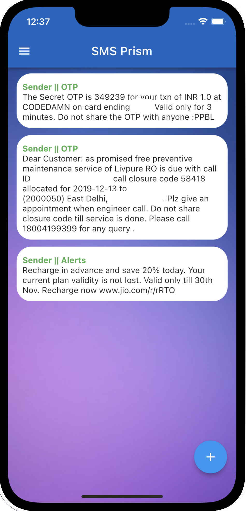

# SMSPrism
We have built an SMS app that could detect spam messages and separate them from the important ones. The whole system works on a client-server architecture where new messages received by the app are sent to the server via an HTTP request to identify spam. We have used the Flask package to design a REST API to achieve client-server communication and to integrate Random Forest Classifier model from the Scikit-Learn Package. The machine learning model filters SMS messages based on the content that it contains. We trained  the  model  using  a  custom  dataset  containing  269  message  samples. Random Forest Classifier gave an overall accuracy of 0.78 on the dataset that has outperformed other models like Support Vector Machine and Naive Bayes model in terms of accuracy. Moreover, the model's accuracy can be increased by training it on a larger dataset.

## Tech Stack Utilized

- Flutter -> Mobile Application development
- Sklearn -> Used the Random Forest Classifier to classify SMS into different categories (Advertising, OTP, Banking, Alerts, Spam etc.).

- Flask -> Used Flask to deploy the model on localhost.
- Languages Used -> Dart & Python

## UI Snapshots

## Installation Steps
> To install the application on your local machine do the following:
>
> 1. Make sure the tech-stack is installed on you system.
> 1. Clone the repository to your local machine.
> 1.  Start the flask API on your local host using 'python ModelCode/deploy.py'
> 1. After the API starts on your local host run the application on your simulator.

## How to contribute?
> - Fork the repository and follow the steps for installation (given above) to set-up the project on your machine.
> - Check if your issue is already present before opening a new issue.
> - Wanting to work on an existing issue? Request the issue to be assigned to you and then start working on it in a seperate branch (do not modify the master branch).
> - Once you achieve a satisfactory result, submit a pull request for review of code changes.
> - Mention the branch where you worked within your pull request along with other relevant details.

## LICENCE
[MIT LICENCE](LICENSE.txt)
